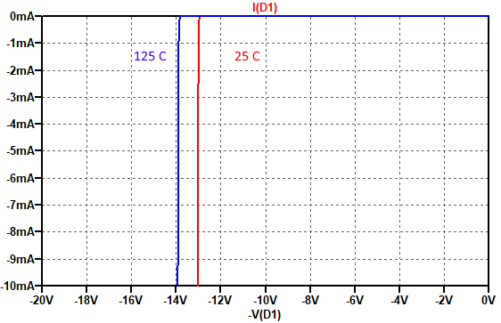
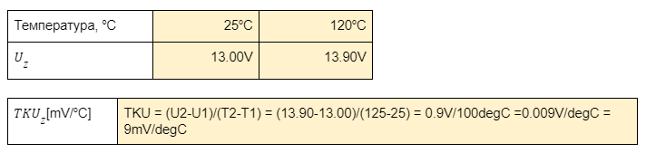
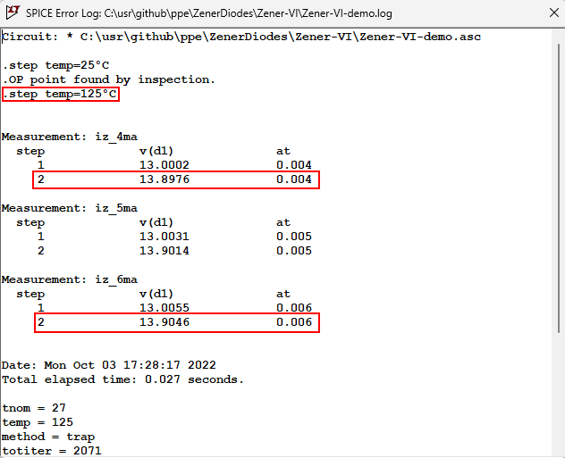

# Схеми за симулация на волт-амперни характеристики на ценерови диоди

Zener Diode V-I characteristics simulation

## Волт-амперни характеристики на ценеров диод при обратно включване, при две различни температури (25C, 125C)




## Определяне на температурният коефициент от автоматичните измервания с LTSpice

Задача: Използвайте резултатите от симулацията за да определите стойността  на температурният коефициент TKUz при Iz=5mA.

LTSpice дава възможност да се извършват автоматични измервания чрез оператор `.meas`. Например следният оператор `.meas DC Iz_5mA FIND V(D1) WHEN I(D1)=-5mA` намира стойността на напрежението в точка D1 (т.е. напрежението върху диода) когато токът през диода I(D1) има стойност -5mA. Получената стойност е означена с `Iz_5mA`.

След симулацията, резултатите от измерванията могат да се видят чрез меню `View > SPICE Error Log`


Изберете нужните резултати и попълнете таблицата:



## Определяне на диференциално съпротивление от автоматичните измервания с LTSpice

Задача: Използвайте резултатите от симулацията за да определите диференциалното съпротивление rd при Iz=5mA и Т = 125C

Ще използваме следните оператори за автоматично измерване:
```
.meas DC Iz_4mA FIND V(D1) WHEN I(D1)=-4mA
.meas DC Iz_6mA FIND V(D1) WHEN I(D1)=-6mA
```
за да получим стойностите на Uz при Iz = 4mA и 6mA.

След симулацията, резултатите от измерванията могат да се видят чрез меню `View > SPICE Error Log`



Нанасяме измерените стойности в таблицата и изчисляваме rd = dU/dI.

