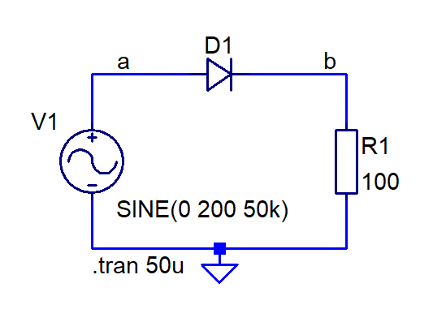
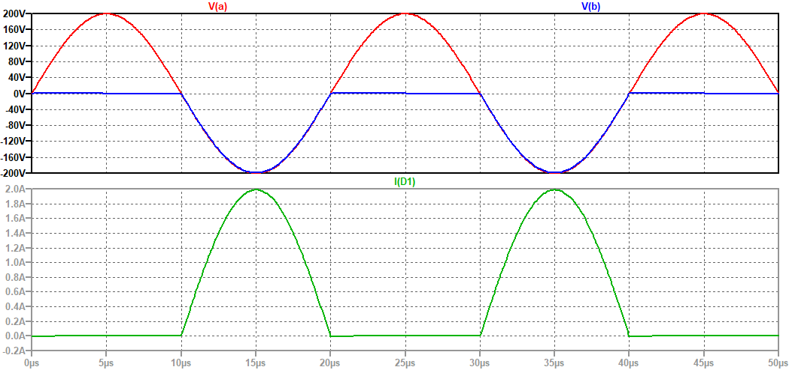
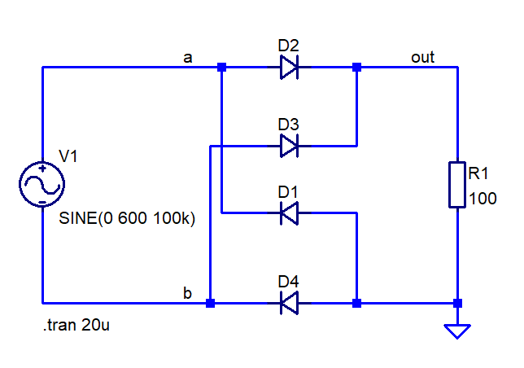

# Схеми на изправители с диоди

Diode rectifiers

На фигурите са показани няколко типа изправителни схеми и резултати от тяхната симулация с LTSpice. 

## Схема, която пропуска само положителните полупериоди на входния сигнал

## Схема, която пропуска само отрицателните полупериоди на входния сигнал

## Мостова схема на изправител (схема на Грец)

