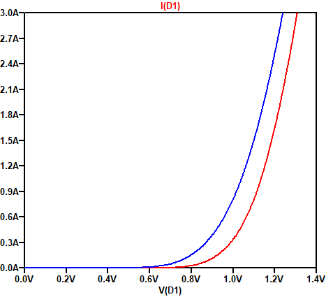
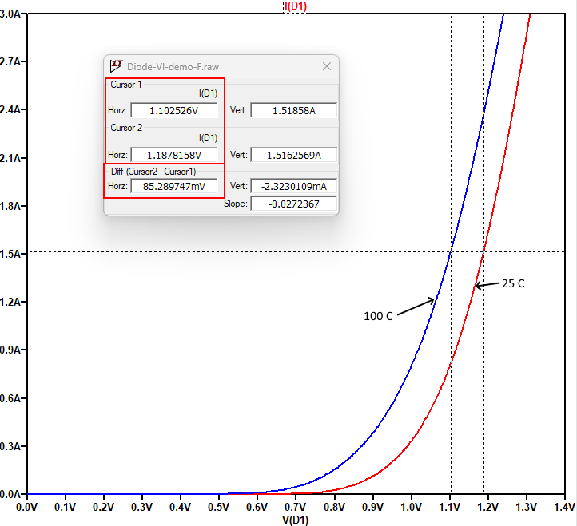
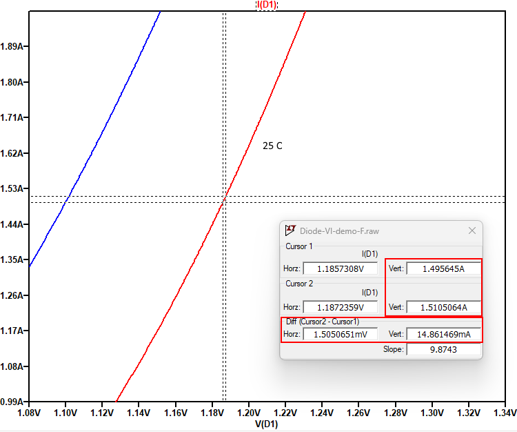

# Схеми за симулация на волт-амперна характеристики на диоди

Diode V-I characteristics simulation

## Волт-амперна характеристика на диод в права посока, при две различни температури (25C, 100C)

## Измерване на температурен коефициент TKUf от волт-амперна характеристика на диод

Задача: Използвайте резултатите от симулацията за да определите температурният коефициент в право включване TKUf при If=1.5A.

* Поставете cursor 1 върху графиката, която съответства на 25C.
* Поставете cursor 2 върху графиката, която съответства на 100C.
* Позиционирайте и двата курсора на "височина" 1.5А.
* Отчетете напреженията, които съответстват на двата курсора.
* Изчислете TKU = (U2 - U1) / (T2 - T1)

## Измерване на диференциално съпротивление от волт-амперна характеристика на диод

Задача: Използвайте резултатите от симулацията за да определите диференциалното съпротивление в право включване rd при If=1.5A,  Т=25C

* Поставете и двата курсора върху графиката, която съответства на 25C.
* Позиционирайте cursor 1 малко преди 1.5A (например 1.49А)
* Позиционирайте cursor 2 малко след 1.5A (например 1.51А)
* Отчетете разликите между координатите на двата курсора в хоризонтална и вертикална посока: dU = 1.50mV, dI = 14.9mA
* Извилсете rd = dU / dI 

