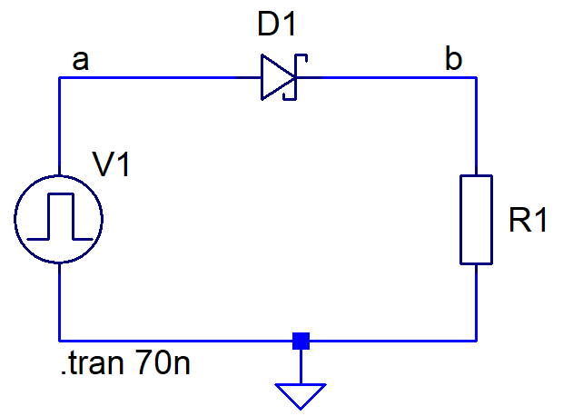
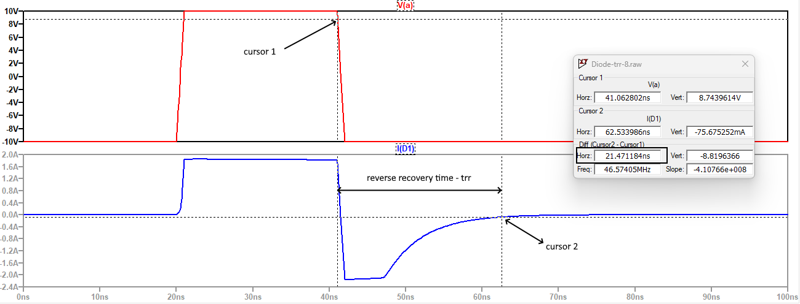

# Време за възстановяване на обратното съпротивление на диод - trr

Diode reverse recovery time measurement.

На фигурите са показани схема за определяне времето за възстановяване на обратното съпротивление на диод (trr) и резултатите от симулацията с LTSpice за различни типове диоди. 

## Изправителен диод с p-n преход
Rectifier p-n junction diode

Измерването на trr се извършва с помощта на куросори, поставени върху времедиаграмата на входният сигнал V(a) и токът през диода I(D1).

## Диод с преход на Шотки
Schottky barrier diode

Измерването на trr се извършва с помощта на куросори, поставени върху времедиаграмата на входният сигнал V(a) и токът през диода I(D1).

"Cursor 1" се намира в спадащият участък на V(a), на около 10% под максималното ниво.

"Cursor 2" е на около 10% от максималната стойност на обратния ток.

## Бърз изправителен диод с p-n преход
Fast-recovery diode

Измерването на trr се извършва с помощта на куросори, поставени върху времедиаграмата на входният сигнал V(a) и токът през диода I(D1).

"Cursor 1" се намира в спадащият участък на V(a), на около 10% под максималното ниво.

"Cursor 2" е на около 10% от максималната стойност на обратния ток.

