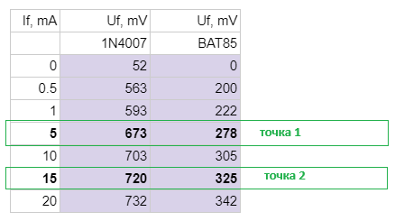

# Изчисляване на статично и диференцианно съпротивления

Статичното съпротивление е отношението на напрежението към тока в една точка от волт-амперната характеристика.

Диференциалното съпротивление се дефинира като отношение на промяна на напреженето към съответната промяна на тока. 

За болшинството волт-амперни характеристики на полупроводникови прибори тези съпротивления са различни в различните точки.

## Задача
Да се опредеят стийностите на статичното и диференциалното съпротивления на изследваните диоди при If=10mA.

По-долу са дадени изчисления за диода 1n4007.

### Статично съпротивление - R = U / I

От таблицата отчитаме стойносттa на Uf при ток 10mA: 703mV. 

За статично съпротивление получаваме R = U / I = 703mV / 10mA = 70.3 Ohm

### Динамично съпротивление - rd = dU / dI = (U2-U1) / (I2-I1)

От таблицата избираме двата отчета, които са най-близо до I=10mA. Тях ще използваме като стойност на U2,I2 и U1,I1.

dU/dI = (U2-U1) / (I2-I1) = (720mV-673mV) / (15mA-5mA) = 47mV / 10mA = 4.7 Ohm

