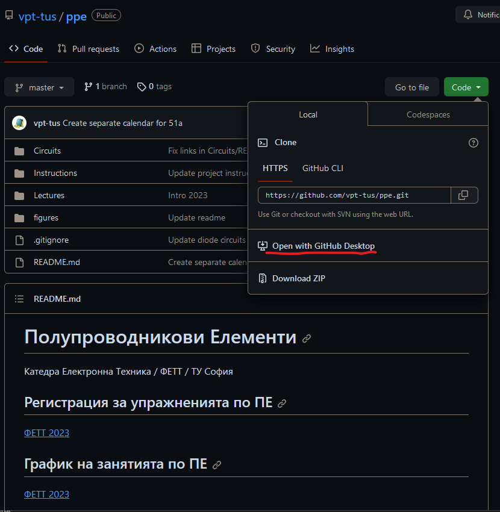
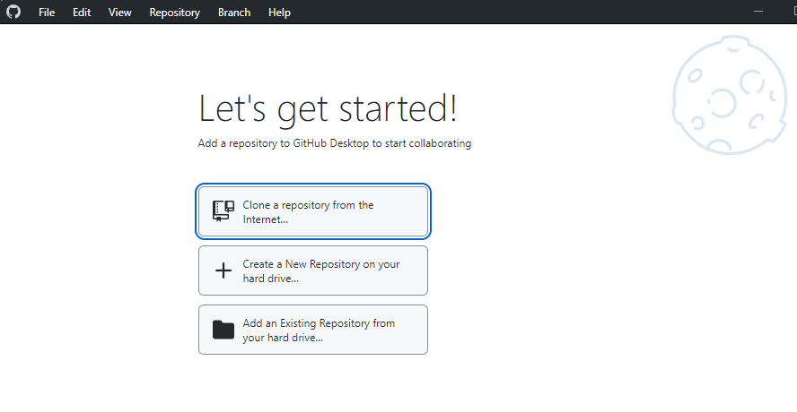
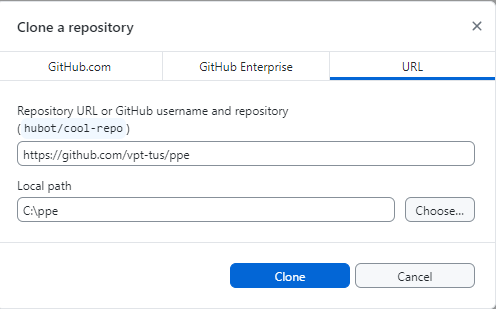
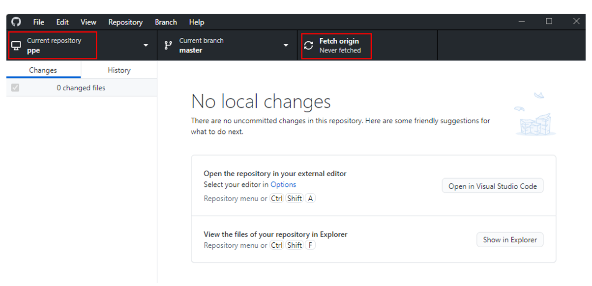

# Клониране на Github репозитория

Repository URL: https://github.com/vpt-tus/ppe

След като завърши клонирането, репозиторията ще намерите в избраният Local path.

За да опресните вашето копие на репозиторията (т.е. да получите последните промени от https://github.com/vpt-tus/ppe), използвайте Fetch origin

